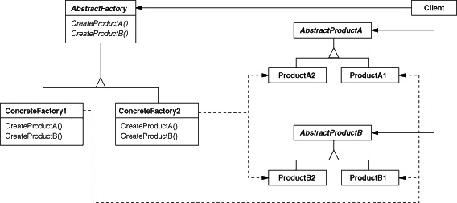

### 抽象工程模式(Abstract Factory)

#### new 的问题

1 常规的对象创建方法

Road road = new Road(); //创建一个 Road 对象

2 new 的问题

实现依赖，不能应对“具体实例化类型”的变化

3 解决思路

封装变化点: 哪里变化，封装哪里

潜台词：如果没有变化，当然不需要额外的封装！

#### 工厂模式的缘起

变化点在“对象创建”，因此就封装“对象创建”

面向接口编程: 依赖接口，而非依赖实现

#### 简单工厂的问题

1 简单工厂的问题：

不能应对“不同系列对象”的变化。比如有不同风格的游戏场景: 对应不同风格的道路、房屋、地道……

2 如何解决

使用面向对象的技术来“封装”变化点

#### 动机

在软件系统中，经常面临着“一系列相互依赖的对象”的创建工作；同时，由于需求的变化，往往存在更多系列对象的创建工作。

如何应对这种变化？如何绕过常规的对象创建方法(new)，提供一种“封装机制”来避免客户程序和这种“多系列具体对象创建工作”的紧耦合？

#### 意图

提供一个接口，让该接口负责创建一系列“相关或者相互依赖的对象”，无需指定它们具体的类。

#### 结构 

客户程序依赖于抽象的类，不依赖具体实现的类。

#### 场景

应对“一系列相互依赖的对象”的创建工作。

8. code

#### 几个要点

如果没有应对“多系列对象构建”的需求变化，则没有必要使用 Abstract Factory 模式，这时候使用简单的静态工厂
完全可以。

“系列对象”指的是这些对象之间有相互依赖、相互作用的关系，例如游戏开发场景中的“道路”与“房屋”的依赖，“道路”
与“地道”的依赖。

Abstract Factory 模式主要在于应对“新系列”的需求变动，其缺点在于难以应对“新对象”的需求变动。

Abstract Factory 模式经常和 Factory Method 模式共同组合来应对“对象创建”的需求变化。