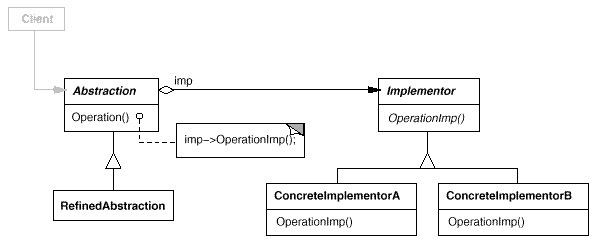
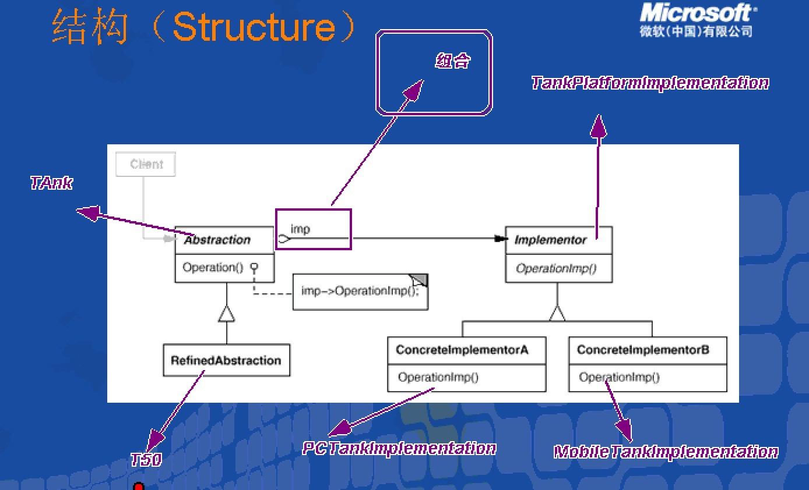

### Adapter (桥接模式)

#### 抽象与实现

抽象不应该依赖于实现细节，实现细节应该依赖于抽象。

 

 

抽象B --> 稳定

实现细节b --> 变化

问题在于如果抽象B由于固有的原因，本身并不稳定，也有可能变化，怎么办？

#### 举例来说

假如我们需要开发一个同时支持PC和手机的坦克游戏，游戏在PC和手机上功能都一样，都有同样的类型，面临同样的功能需求变化，比如坦克可能有多种不同的型号：T50,
T75, T90……

对于其中的坦克设计，我们可能很容易设计出来一个Tank的抽象基类，然后各种不同型号的Tank继承自该类。

抽象部分

```js
public abstract class Tank {
    public abstract Shot();
    public abstract Run();
    public abstract Trun();
}
```

各种实现

```js
public class T50: Tank {……}
public class T75: Tank {……}
public class T90: Tank {……}
```

#### 另外的变化原因

但是PC和手机上的图形绘制、声效、操作等实现完全不同，因此对于各种型号的坦克，都要提供各种不同平台上的坦克实现：

PC平台实现

```js
public class PCT50:T50 {……}
public class PCT75: T75 {……}
public class PCT90: T90 {……}
```

手机平台实现

```js
public class MobileT50: T50 {……}
public class MobileT75: T75 {……}
public class MobileT90: T90 {……}
```

这样的设计会带来很多问题：有很多重复代码，类的结构过于复杂，难以维护，最致命的是引入任何新平台，比如在TV上的Tank游戏，都会让整个类层级结构复杂化

#### 动机（Motivation）

思考上述问题的症结：事实上由于Tank类型的固有逻辑，使得Tank类型具有了两个变化的维度: 一个变化的维度为 ``` 平台的变化 ```，一个变化的维度为 ``` 型号的变化 ```

如何应对这种 ``` 多维度的变化 ``` ？如何利用面向对象技术来使得Tank类型可以轻松地沿着 ``` 平台 ``` 和 ``` 型号 ``` 两个方向变化，而不引入额外的复杂度？

#### 意图

将抽象部分与实现部分分离，使它们都可以独立地变化。

#### 结构

 

#### 实现

 

#### 几个要点

* Bridge模式使用 ``` 对象间的组合关系 ``` 解耦了抽象和实现之间固有的绑定关系，使得抽象（Tank的型号）和实现（不同的平台）可以沿着各自的维度来变化

* 所谓抽象和实现沿着各自纬度的变化，即 ``` 子类化 ``` 它们，比如不同的Tank型号子类，和不同的平台子类。得到各个子类之后，便可以任意组合它们，从而获得不同平台上的不同型号

* Bridge模式有时候类似于多继承方案，但是多继承方案往往违背单一职责原则（即一个类只有一个变化的原因），复用性比较差。Bridge模式是比多继承方案更好的解决方法

* Bridge模式的应用一般在 ``` 两个非常强的变化维度 ```，有时候即使有两个变化的维度但是某个方向的变化维度并不剧烈——换言之两个变化不会导致纵横交错的结果，并不一定要使用Bridge模式


#### 总结

优点

* 分离接口和实现部分，一个实现未必不变地绑定在一个接口上，抽象类（函数）的实现可以在运行时刻进行配置，一个对象甚至可以在运行时刻改变它的实现，同将抽象和实现也进行了充分的解耦，也有利于分层，从而产生更好的结构化系统

* 提高可扩充性

* 实现细节对客户透明，可以对客户隐藏实现细节

缺点

* 大量的类将导致开发成本的增加，同时在性能方面可能也会有所减少
