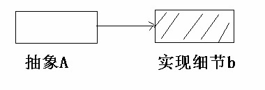
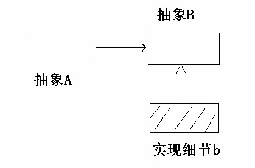
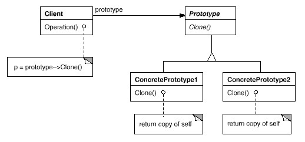

### Prototype 原型(创建型模式 )

#### 依赖关系的倒置

抽象不应该依赖于实现细节，实现细节应该依赖于抽象。

抽象 A 直接依赖于实现细节 b



抽象 A 依赖于抽象 B，实现细节 b 依赖于抽象 B



#### 动机

在软件系统中，经常面临着 ``` 某些结构复杂的对象 ``` 的创建工作；由于需求的变化，这些对象经常面临着剧烈的变化，但是它们却拥有比较稳定一致的接口。

如何应对这种变化？如何向 ``` 客户程序（使用这些对象的程序）``` 隔离出 ``` 这些易变对象 ``` ，从而使得 ``` 依赖这些易变对象的客户程序 ``` 不随着需求改变而改变？

#### 意图

使用原型实例指定创建对象的种类，然后通过拷贝这些原型来创建新的对象。

#### 结构




#### 几个要点

 ``` Prototype ```  模式同样用于隔离类对象的使用者和具体类型（易变类）之间的耦合关系，它同样要求这些 ``` 易变类 ``` 拥有 ``` 稳定的接口 ``` 

 ``` Prototype ```  模式对于 ``` 如何创建易变类的实体对象 ``` 采用 ``` 原型克隆 ``` 的方法来做，它使得我们可以非常灵活地动态创建 ``` 拥有某些稳定接口 ``` 的新对象——所需工作仅仅是注册一个新类的对象（即原型），然后在任何需要的地方不断地  ``` Clone ``` 